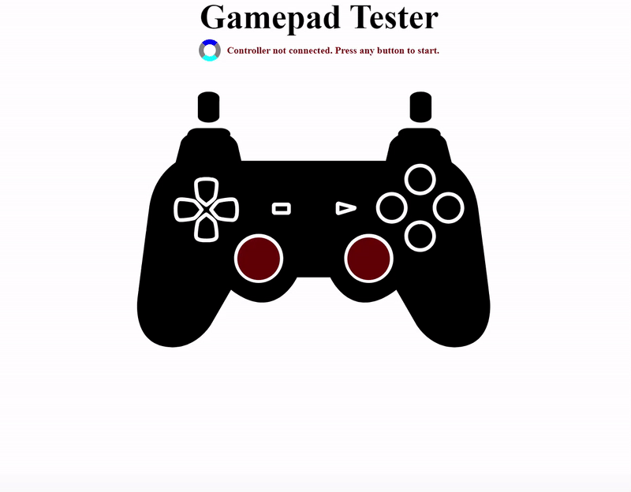

# Gamepad Tester using the GamePad-API 

This project was created using the [**Gamepad API**](https://developer.mozilla.org/en-US/docs/Web/API/Gamepad_API) and by following the [**JavaScript Gamepad Tester Tutorial**](https://youtu.be/tQyrpcOK6U0?si=Bl0z4gGgTv2pXoZD) created by YouTuber [**@CodingWithAdam**](https://www.youtube.com/@CodingWithAdam).
Please see below **Acknowledgements** section for full list resources and links.

## Usage
This repository contains a simple JavaScript code that enables a web-based interface for monitoring and visualizing inputs from a gamepad controller. The interface dynamically updates to display controller buttons and axes, and supports optional rumble effects triggered by button presses.

## Features

- Displays controller buttons and axes when a gamepad is connected.
- Visual representation of buttons using rectangles with text labels.
- Numeric display of axes values and SVG circles for stick positions.
- Supports optional rumble effect triggered by button presses.

## Functions

- `handleConnectDisconnect(event, connected)`: Manages gamepad connection and disconnection events.
- `createAxesLayout(axes)`: Creates the layout for displaying axes values.
- `createButtonLayout(buttons)`: Creates the layout for displaying buttons.
- `createButtonHtml(index, value)`: Generates HTML code for displaying a button.
- `updateButtonOnGrid(index, value)`: Updates visual display of button values on the grid.
- `updateControllerButton(index, value)`: Updates visual display of controller button values.
- `handleButtons(buttons)`: Updates button values and displays.
- `handleSticks(axes)`: Updates stick values and displays.
- `updateAxesGrid(axes)`: Updates visual display of axes values on the grid.
- `updateStick(elementId, leftRightAxis, upDownAxis)`: Updates stick visualization position.
- `handleRumble(gamepad)`: Manages rumble effect triggered by button presses.
- `gameLoop()`: Main loop for continuous display updates based on gamepad state.

## Compatibility

Tested and compatible with modern browsers supporting the Gamepad API.

## Resources & Acknowledgements

This project was created using the **Gamepad API**: [https://developer.mozilla.org/en-US/docs/Web/API/Gamepad_API](https://developer.mozilla.org/en-US/docs/Web/API/Gamepad_API), 
and by following the **JavaScript Gamepad Tester Tutorial**: [https://youtu.be/tQyrpcOK6U0?si=Bl0z4gGgTv2pXoZD](https://youtu.be/tQyrpcOK6U0?si=Bl0z4gGgTv2pXoZD)

Tutorial created by YouTuber **@CodingWithAdam** [https://www.youtube.com/@CodingWithAdam](https://www.youtube.com/@CodingWithAdam)

Original **gamepad-api-simple-game GitHub Repo** here: [https://github.com/CodingWith-Adam/gamepad-api-simple-game](https://github.com/CodingWith-Adam/gamepad-api-simple-game)

Please check out his GitHub profile for more of his work here: [https://github.com/CodingWith-Adam](https://github.com/CodingWith-Adam)  

**Controller Image SVG Code**: [https://gist.github.com/CodingWith-Adam/66f62365af3214b9fa7c1342c71264de](https://gist.github.com/CodingWith-Adam/66f62365af3214b9fa7c1342c71264de)
